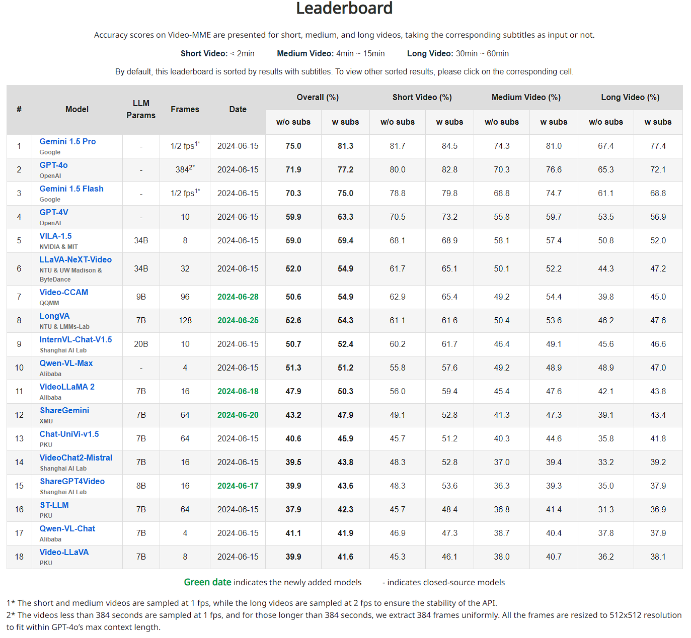

# Video-CCAM: Advancing Video-Language Understanding with Causal Cross-Attention Masks

## Updates

- **2024/07/16**: [Video-CCAM-14B](https://huggingface.co/JaronTHU/Video-CCAM-14B) is released, which achieves 53.2 (without subtitles) and 57.4 (with subtitles) [96 frames] on the challenging [Video-MME](https://video-mme.github.io/home_page.html) benchmark. With 16 frames, it achieves 61.43.

- **2024/06/29**: Support [MVBench](https://github.com/OpenGVLab/Ask-Anything/blob/main/video_chat2/MVBENCH.md) evaluation. With 16 frames, [Video-CCAM-4B](https://huggingface.co/JaronTHU/Video-CCAM-4B) achieves 57.78, while [Video-CCAM-9B](https://huggingface.co/JaronTHU/Video-CCAM-9B) achieves 60.70.

- **2024/06/28**: [Video-CCAM-9B](https://huggingface.co/JaronTHU/Video-CCAM-9B) is released, which achieves 50.6 (without subtitles) and 54.9 (with subtitles) [96 frames] on the challenging [Video-MME](https://video-mme.github.io/home_page.html) benchmark. After increasing the number of frames to 96, [Video-CCAM-4B](https://huggingface.co/JaronTHU/Video-CCAM-4B) also has better scores as 49.6 (without subtitles) and 53.0 (with subtitles).

- **2024/06/24**: [Video-CCAM-4B](https://huggingface.co/JaronTHU/Video-CCAM-4B) is released, which achieves 48.2 (without subtitles) and 51.7 (with subtitles) [32 frames] on the challenging [Video-MME](https://video-mme.github.io/home_page.html) benchmark.

## Model Summary

Video-CCAM is a series of flexible Video-MLLMs developed by TencentQQ Multimedia Research Team.

## Usage

Inference using Huggingface transformers on NVIDIA GPUs. Requirements tested on python 3.9/3.10：
```
torch==2.1.0
torchvision==0.16.0
transformers==4.40.2
peft==0.10.0
pyarrow==13.0.0
decord==0.6.0
pysubs2==1.7.2
```

### Sample Inference Code

```
import torch

from eval import load_decord
from model import create_videoccam

video_path = 'assets/example.mp4'
question = '<video>\nCan you please describe what happens in the video in detail?'

sample_config = dict(
    sample_type='uniform',
    num_frames=32
)

mllm = create_videoccam(
    model_name='Video-CCAM-4B',
    model_path='your/model/path>',
    # llm_name_or_path='your/local/llm/path',                   # automatically download by default
    # visual_encoder_name_or_path='your/local/siglip/path',     # automatically download by default
    torch_dtype='bfloat16',
)

frames = load_decord(video_path, **sample_config)
response = mllm.generate(texts=[question], videos=[frames])[0]

print(response)
```

## Evaluation

### Video-MME

* Video-CCAM-4B, 96 frames

```
python evaluate.py --model_name Video-CCAM-4B \
    --model_path your/model/path \
    --dtype bfloat16 \
    --num_frames 96 \
    --benchmark Video-MME \
    --dataset_path your/video_mme/data/path \
    --output_dir your/output_dir
```

* Video-CCAM-9B, 96 frames

```
python evaluate.py --model_name Video-CCAM-9B \
    --model_path your/model/path \
    --dtype bfloat16 \
    --num_frames 96 \
    --benchmark Video-MME \
    --dataset_path your/video_mme/data/path \
    --output_dir your/output_dir
```



## Acknowledgement

* [xtuner](https://github.com/InternLM/xtuner): Video-CCAM is trained using the xtuner framework. Thanks for their excellent works!
* [Phi-3-mini-4k-instruct](https://huggingface.co/microsoft/Phi-3-mini-4k-instruct): Powerful language models developed by Microsoft.
* [Yi-1.5-9B-Chat](https://huggingface.co/01-ai/Yi-1.5-9B-Chat): Powerful language models developed by [01.AI](https://www.lingyiwanwu.com/).
* [Phi-3-medium-4k-instruct](https://huggingface.co/microsoft/Phi-3-medium-4k-instruct): Powerful language models developed by Microsoft.
* [SigLIP SO400M](https://huggingface.co/google/siglip-so400m-patch14-384): Outstanding vision encoder developed by Google.

