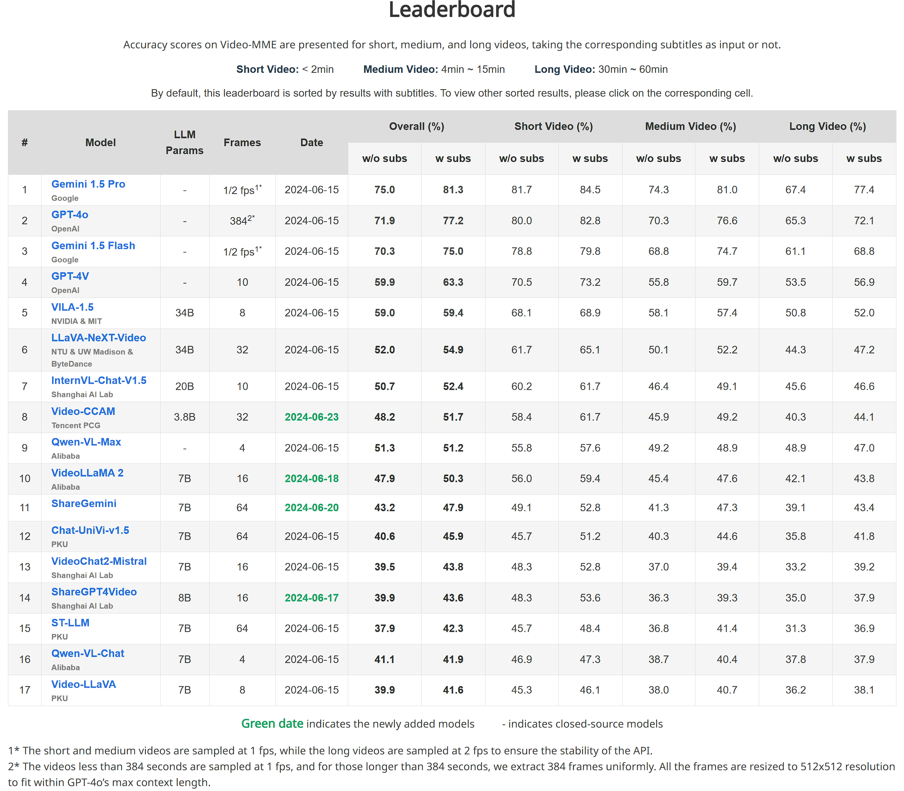

# Video-CCAM: Advancing Video-Language Understanding with Causal Cross-Attention Masks

## Updates

- **2024/06/24**: [Video-CCAM-4B](https://huggingface.co/JaronTHU/Video-CCAM-4B) is released, which achieves 48.2 (without subtitles) and 51.7 (with subtitles) on the challenging [Video-MME](https://video-mme.github.io/home_page.html) benchmark.

## Model Summary

Video-CCAM is a lightweight flexible Video-MLLM developed by TencentQQ Multimedia Research Team.

## Usage

Inference using Huggingface transformers on NVIDIA GPUs. Requirements tested on python 3.10：
```
torch==2.1.0
torchvision==0.16.0
transformers==4.40.2
peft==0.10.0
pyarrow==13.0.0     # load parquet
decord==0.6.0       # load video
pysubs2==1.7.2      # load subtitle
```

### Sample Inference Code

```
import torch

from eval import load_video
from videoccam import VideoCCAM

video_path = 'assets/example.mp4'
question = 'Can you please describe what happens in the video in detail?'

sample_config = dict(
    sample_type='uniform',
    num_frames=32
)

mllm = VideoCCAM(
    model_path='.',
    chat_template='<|user|>\n{input}<|end|>\n<|assistant|>\n',
    generation_args=dict(
        stop_tokens=['<|end|>', '<|endoftext|>'],
        max_new_tokens=512,
        do_sample=False,
        num_beams=5,
    ),
    llm_name_or_path='microsoft/Phi-3-mini-4k-instruct',    # you can replace this with local directory if the model has been downloaded before
    visual_encoder_name_or_path='google/siglip-so400m-patch14-384',     # you can replace this with local directory if the model has been downloaded before
    special_tokens=['<time>', '</time>'],
    visual_select_layer=-2,
    torch_dtype=torch.bfloat16,
    device_map='cuda:0'
)

frames, = load_video(video_path, **sample_config)
response = mllm.generate(texts=[question], videos=[frames])[0]

print(response)
```

### Video-MME Evaluation

You are expected to reproduce the results by running the following command. By default, the results are saved as `output_w_sub.json` and `output_wo_sub.json` in local directory.

```
python eval.py
```



## Acknowledgement

* [xtuner](https://github.com/InternLM/xtuner): Video-CCAM-4B is trained using the xtuner framework. Thanks for their excellent works!
* [Phi-3-Mini-4K-Instruct](https://huggingface.co/microsoft/Phi-3-mini-4k-instruct): Great small language models developed by Microsoft.
* [SigLIP SO400M](https://huggingface.co/google/siglip-so400m-patch14-384): Outstanding vision encoder developed by Google.

