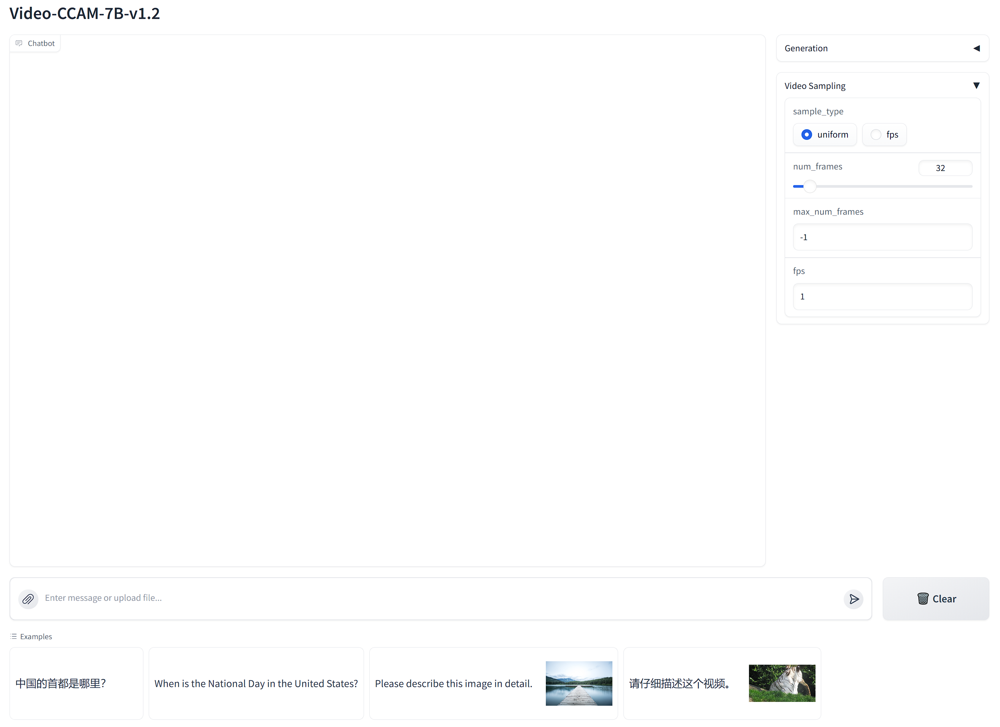
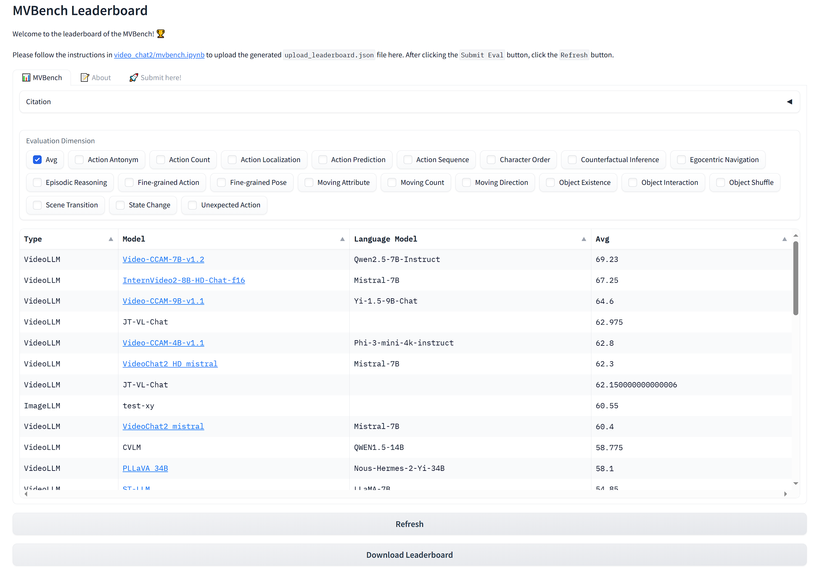

# Video-CCAM: Enhancing Video-Language Understanding with Causal Cross-Attention Masks for Short and Long Videos

<a src="https://img.shields.io/badge/cs.CV-2305.06355-b31b1b?logo=arxiv&logoColor=red" href="https://arxiv.org/abs/2408.14023"> 
</a>

## Updates

- **2024/09/29** [Video-CCAM-v1.2](https://huggingface.co/collections/JaronTHU/video-ccam-v12-66f9221c5144a8d0c6b9602a) has been released, featuring: 1. Enhanced performance on public benchmarks. 2. Support for Chinese. 3. Deployment with Gradio. Have a try!

- **2024/08/28** The technical report is released.

- **2024/08/22** [Video-CCAM-v1.1](https://huggingface.co/collections/JaronTHU/video-ccam-v11-66c7325edd01a54c939df48b) comes out, with better performances than Video-CCAM in many benchmarks, especially in [MVBench](https://github.com/OpenGVLab/Ask-Anything/blob/main/video_chat2/MVBENCH.md), [VideoVista](https://videovista.github.io/), and [MLVU](https://github.com/JUNJIE99/MLVU). The technical report is coming soon. The source code is rewritten for simpler deployment. If you are interested in previous scripts, please refer to the `v1.0` release.

- **2024/08/21** Support [VideoVista](https://videovista.github.io/) evaluation.

- **2024/07/22** Support [MLVU](https://github.com/JUNJIE99/MLVU) evaluation. With 96 frames, [Video-CCAM-14B](https://huggingface.co/JaronTHU/Video-CCAM-14B) achieves M-Avg as 60.18 and G-Avg as 4.11. Besides, Video-CCAM models are evaluated on [VideoVista](https://videovista.github.io/), ranking 2nd and 3rd among all open-source MLLMs.

- **2024/07/16**: [Video-CCAM-14B](https://huggingface.co/JaronTHU/Video-CCAM-14B) is released, which achieves 53.2 (without subtitles) and 57.4 (with subtitles) [96 frames] on the challenging [Video-MME](https://video-mme.github.io/home_page.html) benchmark. With 16 frames, it achieves 61.43.

- **2024/06/29**: Support [MVBench](https://github.com/OpenGVLab/Ask-Anything/blob/main/video_chat2/MVBENCH.md) evaluation. With 16 frames, [Video-CCAM-4B](https://huggingface.co/JaronTHU/Video-CCAM-4B) achieves 57.78, while [Video-CCAM-9B](https://huggingface.co/JaronTHU/Video-CCAM-9B) achieves 60.70.

- **2024/06/28**: [Video-CCAM-9B](https://huggingface.co/JaronTHU/Video-CCAM-9B) is released, which achieves 50.6 (without subtitles) and 54.9 (with subtitles) [96 frames] on the challenging [Video-MME](https://video-mme.github.io/home_page.html) benchmark. After increasing the number of frames to 96, [Video-CCAM-4B](https://huggingface.co/JaronTHU/Video-CCAM-4B) also has better scores as 49.6 (without subtitles) and 53.0 (with subtitles).

- **2024/06/24**: [Video-CCAM-4B](https://huggingface.co/JaronTHU/Video-CCAM-4B) is released, which achieves 48.2 (without subtitles) and 51.7 (with subtitles) [32 frames] on the challenging [Video-MME](https://video-mme.github.io/home_page.html) benchmark.

## Model Summary

Video-CCAM is a series of flexible Video-MLLMs developed by TencentQQ Multimedia Research Team.

## Usage

Inference using Huggingface transformers on NVIDIA GPUs. Requirements tested on python 3.9/3.10.
```
pip install -U pip torch transformers accelerate peft decord pysubs2 imageio
# flash attention support
pip install flash-attn --no-build-isolation
```

## Inference

```
import os
import torch
from huggingface_hub import snapshot_download
from PIL import Image
from transformers import AutoImageProcessor, AutoModel, AutoTokenizer

from eval import load_decord

os.environ['TOKENIZERS_PARALLELISM'] = 'false'

# if you have downloaded this model, just replace the following line with your local path
model_path = snapshot_download(repo_id='JaronTHU/Video-CCAM-7B-v1.2')

videoccam = AutoModel.from_pretrained(
    model_path,
    trust_remote_code=True,
    torch_dtype=torch.bfloat16,
    device_map='cuda:0',
    attn_implementation='flash_attention_2'
)

tokenizer = AutoTokenizer.from_pretrained(model_path)

image_processor = AutoImageProcessor.from_pretrained(model_path)

messages = [
    [
        {
            'role': 'user',
            'content': '<image>\nDescribe this image in detail.'
        }
    ], [
        {
            'role': 'user',
            'content': '<video>\n请仔细描述这个视频。'
        }
    ]
]

images = [
    [Image.open('assets/example_image.jpg').convert('RGB')],
    load_decord('assets/example_video.mp4', sample_type='uniform', num_frames=32)
]

response = videoccam.chat(messages, images, tokenizer, image_processor, max_new_tokens=512, do_sample=False)

print(response)
```

Please refer to `tutorial.ipynb` for more details.

## Demo

To launch a Gradio demo locally, please first install `gradio`:
```
pip install gradio
```
Then run the following command:
```
python web_demo.py --model_path <your_local_path>
```

The demo is shown in the following figure. You can change the generation configuration (max_new_tokens, temperature, top_k, ...) and the video sampling configuration in the left panels.



## Leaderboards

### MVBench



### VideoVista


### MLVU


### Video-MME


## Acknowledgement

* [xtuner](https://github.com/InternLM/xtuner): Video-CCAM is trained using the xtuner framework. Thanks for their excellent works!
* [Phi-3-mini-4k-instruct](https://huggingface.co/microsoft/Phi-3-mini-4k-instruct), [Phi-3.5-mini-instruct](https://huggingface.co/microsoft/Phi-3.5-mini-instruct), and [Phi-3-medium-4k-instruct](https://huggingface.co/microsoft/Phi-3-medium-4k-instruct): Powerful language models developed by Microsoft.
* [Qwen2.5-7B-Instruct](https://huggingface.co/Qwen/Qwen2.5-7B-Instruct): Excellent language models developed by Alibaba Cloud.
* [Yi-1.5-9B-Chat](https://huggingface.co/01-ai/Yi-1.5-9B-Chat): Powerful language models developed by [01.AI](https://www.lingyiwanwu.com/).
* [SigLIP SO400M](https://huggingface.co/google/siglip-so400m-patch14-384): Outstanding vision encoder developed by Google.
